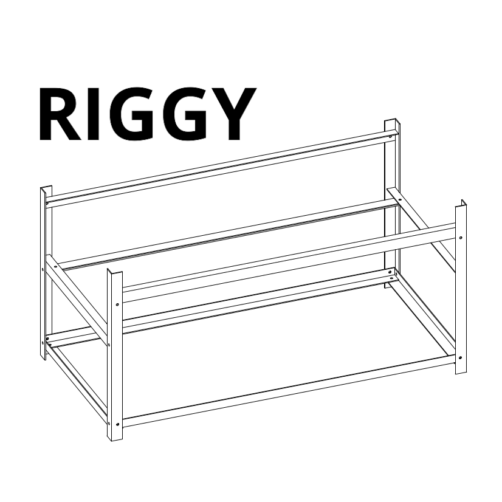

# Stackable aluminium open air case frame for GPU Mining Rig
This DIY minercase was made with simplicity in mind. It is made from aluminum angle bar that can be found in any hardware store.

## Cryptocurrencies

It wasn’t meant to mine any specific coin but it’s used in real life with 6 AMD RX570 2x600w PSU, mining Dagger hashimoto (ETH, ETC, …) and/or Cryptonite (XMR, ...) algorithms.

## Design

Aluminum is light, robust, durable and elegant. It is not very conductive, (and you could push that even further with anodized aluminum) and doesn’t retain heat. And keep the overall frame lightweight thus easy to move around.

The base design is open and keep space between your electronic components and graphic cards for better thermal dissipation and preventing them of interfering with each other for a quitter result. 
Reserved enough space for equipment overhaul enhancing the cooling and extending the lifespan of graphics cards 

The basic design dimension are as follow 640mm x 320mm x 320mm
> <3 round numbers :)

- **Dimensions** 640mm x 320mm x 320mm
- **Weight** ???
- **Material** aluminium. 
- **Color** silver

The design is modular and variations can be made :
- to fit high capacity
- as a shelf / rack
- adapted to 6, 8, 12 GPU

## CAD (Computer-aided design)

The conception was made with [Freecad](https://www.freecadweb.org/) but a few exports are available for other CAD softwares:
- STEP or IGES for **Solidworks**
- DWG for **AutoCad** or **Sketchup**

### Parameters
The rig as been parameterised in Freecad via a Spreadsheet for easier customization.
The following parameters are available:

Every piece of the frame are made of standard aluminium corners but you can change their characteristics depending on your findings:
**bar_thickness** 1.5mm
**bar_width** 20mm
**bar_height** 15mm
**graphic_card_length** 270mm
**graphic_card_height** 112mm
**width** 640mm
**height** 320mm
**bottom_empty_space** 20mm
**top_empty_space** 20mm
> You can easily switch these values from mm to inches
> For example of you’d like to fit 12 graphic cards instead of 6 you could simply raise the `width` of the design. 

- You could put 2 range of graphic cards or 1 range of graphic card with a double width design
- Could fit any kind of motherboard, graphic card, any kind of  hardware with the proper tweaks.
- It was tought for usage with 120mm fans but not a requirement.
- The design can be made stackable in two ways.
- If your planning from the start to fit many mining rig in the same design you need to double or triple the vertical bar and duplicate the design as many time as required.
- If it’s an afterthought process, just make another case and print this little 3D printed piece (we’re to call it the *joiner*) to maintain the cases together.

## Make

### Required tools
- rivet plier
- drill bit for aluminum (1 of )
- tap (to create threaded holes, to secure the graphic cards)
- metal saw

### Consumables
- 28  pop rivets - 4x10mm
- regular case screws
- spacers to secure your motherboard (usually shipped with any case, but can be found online, or scavenged from old cases)
> https://upload.wikimedia.org/wikipedia/commons/e/ef/Toennchen_IMGP5029_wp.jpg

This rig is only made of 2 types of aluminium angle bar:
- One with equal sides, from a profile view it would looks as this ⌟
- One with a shorter side, from a profile view it would looks as this  ｣
> https://www.bricodepot.fr/lyon-st-priest/corniere-en-aluminium-brut-l-250m-l-20mm-h-20mm-ep-15mm/prod1791/
> https://decines.entrepot-du-bricolage.fr/pr-corniere-egale-en-aluminium-anodise-15x15cm-couleur-argent-2-5m-rqdb020205-1089668,40917,71,332,794,1238.htm

> Here is a formula to calculate the total length of raw material required.
> length of ⌟ required =  4 * height
> length of ｣ required =  5 * width + 4 depth

> For example if the bars were sold by units of 2 meters each:
>You would need:
> ⌟
>4 * `unit_length`
> `sold_length`
> `number_of_bars_required`
> |`Sold_length` / 4 * `unit_length`|

### Manual

[The manual](manual.pdf) as other parts of the project is a work in progress...

### Bonuses
- To reduce vibrations you can create rubber washer out of old bike tires and a hollow hole punch for leather.
- There is a 3D printable *foot* `projects/foot.fcstd` that could be made out of soft plastic or rubber like material, but these kind of materials doesn’t come cheap unfortunately.

